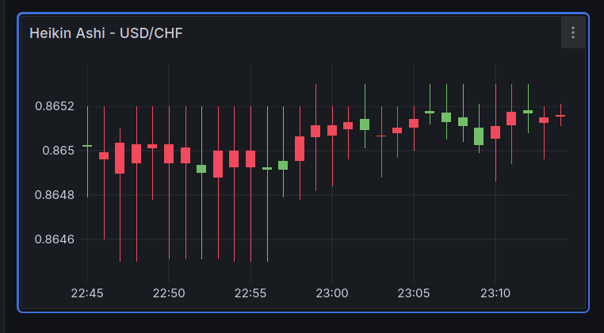

# Heikin Ashi Forex Analysis for USD/CHF Symbol

## Overview

This project focuses on analyzing the USD/CHF forex pair using Heikin Ashi candlesticks, which are a variation of traditional OHLC (Open, High, Low, Close) candlesticks and are often used for identifying trends more clearly.

## Data Source

- **API**: [Alpha Vantage Intraday Forex API](https://www.alphavantage.co/documentation/#fx-intraday)
- **Output Format**: JSON

## Process

1. **Data Retrieval**: 
   - Forex data for the USD/CHF pair is fetched from the Alpha Vantage Intraday Forex API at regular intervals.

2. **Data Transformation**:
   - The JSON data obtained from the API is converted into a Pandas DataFrame.
   - Heikin Ashi values are calculated based on the OHLC data provided by the API.

3. **Database Storage**:
   - The transformed Heikin Ashi data is then pushed into a locally hosted InfluxDB instance for efficient time-series storage.

4. **Monitoring and Visualization**:
   - Grafana is configured to monitor the Heikin Ashi data stored in InfluxDB.
   - Grafana dashboards are used to visualize the data, allowing for predictive analysis and trend monitoring.

## Tools and Technologies

- **Programming Language**: Python (Pandas for data manipulation)
- **Database**: InfluxDB (Time-series data storage)
- **Monitoring and Visualization**: Grafana

## Usage

1. Set up your local InfluxDB instance.
2. Configure Grafana to connect to your InfluxDB instance.
3. Run the Python script to fetch, transform, and push data into InfluxDB.
4. Monitor the Heikin Ashi candlestick trends on the Grafana dashboard.

## License

This project is licensed under the MIT License. See the [LICENSE](LICENSE) file for details.

